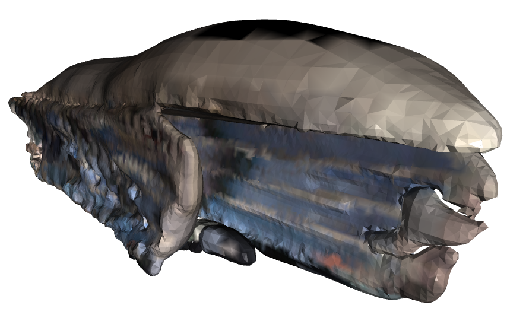
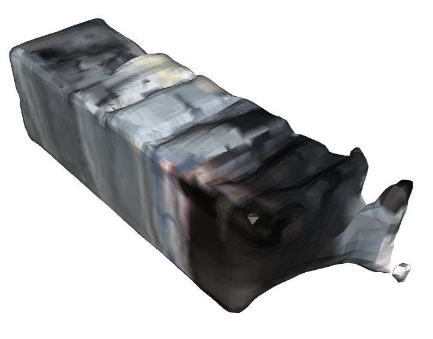
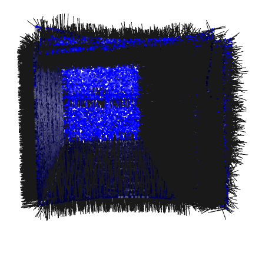
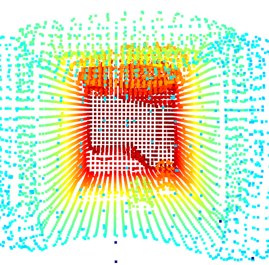
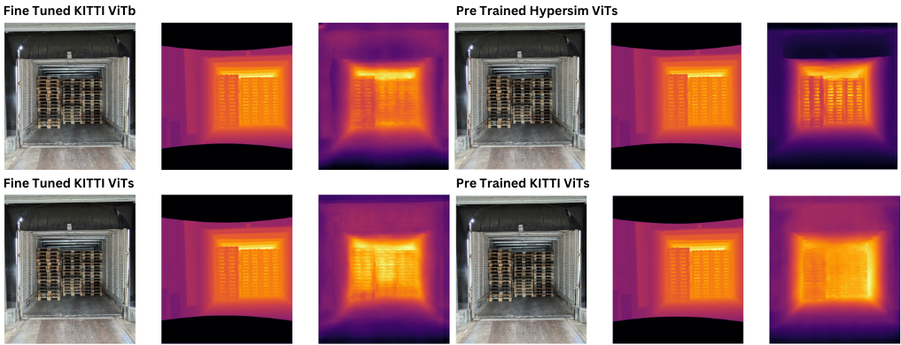
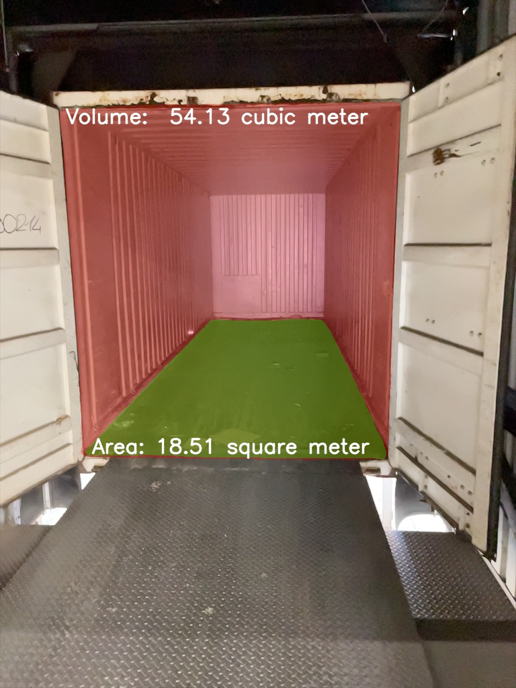

# CargoSight

## A Monocular Vision Architecture for Cargo Fill Estimation

[](LICENSE)

## Overview
CargoSight is a novel computer vision pipeline designed for fast and accurate estimation of unutilized space in cargo containers using a single RGB image. This project was developed as part of the Master's thesis *"A Monocular Vision Architecture for Container Free Volume Estimation"*.

The proposed method leverages monocular depth estimation to reconstruct a watertight 3D model of the container and subsequently estimate its remaining volume. This approach enables efficient logistics optimization by reducing manual measurement efforts and automating cargo load assessments.

---

## Pipeline

The following diagram illustrates the complete end-to-end pipeline of CargoSight:


---

## Methodology

### **1. Container Reconstruction using Monocular Depth Estimation**
CargoSight employs a monocular depth estimation model as a prior for 3D reconstruction.

<div style="display: flex;">
    
    
</div>

*Example of depth-based reconstruction of a cargo container from a single RGB image.*

### **2. Refinement and Normal Correction**
The estimated depth undergoes normal correction to refine the 3D surface reconstruction.

<div style="display: flex;">
    
    
</div>

*Illustration of normal correction and point cloud downsampling applied to depth estimations.*

### **3. Volume Estimation Pipeline**
A watertight 3D mesh of the container is generated to facilitate accurate volume estimation.


*Steps involved in computing free volume inside a container.*

---

## Results

### **Qualitative Evaluation**
CargoSight demonstrates robust reconstruction capabilities across different cargo scenarios.



*Comparison of reconstructed cargo spaces and their corresponding free volume estimations.*

### **Final Estimated Volume Output**
The final output provides an estimation of the available space in cubic meters.

<div style="display: flex;">
    
    
</div>

*Visualization of the final container volume computation.*

---

## Performance
The pipeline achieves a full estimation within **5 seconds**, making it suitable for real-time applications in logistics and warehouse automation.

---

## Installation & Usage

To use CargoSight, clone this repository and install the required dependencies:
```sh
git clone https://github.com/yourusername/cargosight.git
cd cargosight
pip install -r requirements.txt
```

---

## License

License for CargoSight©
Copyright (c) [2025] [Ashwin Nedungadi]

All rights reserved.

No part of this software, including the source code, may be reproduced, modified, or distributed, in whole or in part, without the prior explicit written permission of the copyright holder. This prohibition applies to any form of use—personal, educational, or otherwise—unless a separate written agreement granting such rights has been executed.

Furthermore, the use of this software for commercial purposes is strictly prohibited unless the copyright holder has provided explicit, written permission. Any violation of this restriction will be considered an infringement of the copyright holder’s rights.

THE SOFTWARE IS PROVIDED "AS IS", WITHOUT WARRANTY OF ANY KIND, EXPRESS OR IMPLIED, INCLUDING BUT NOT LIMITED TO THE WARRANTIES OF MERCHANTABILITY, FITNESS FOR A PARTICULAR PURPOSE, AND NONINFRINGEMENT. IN NO EVENT SHALL THE COPYRIGHT HOLDER BE LIABLE FOR ANY CLAIM, DAMAGES, OR OTHER LIABILITY, WHETHER IN AN ACTION OF CONTRACT, TORT, OR OTHERWISE, ARISING FROM, OUT OF OR IN CONNECTION WITH THE SOFTWARE OR THE USE OR OTHER DEALINGS IN THE SOFTWARE.

For permission requests, inquiries, or licensing proposals, please contact: [ashwin.suresh.nedungadi@fraunhofer.iml.de].

---

## Contact
For questions or collaboration inquiries, please contact [ashwin.ned@gmail.com].

